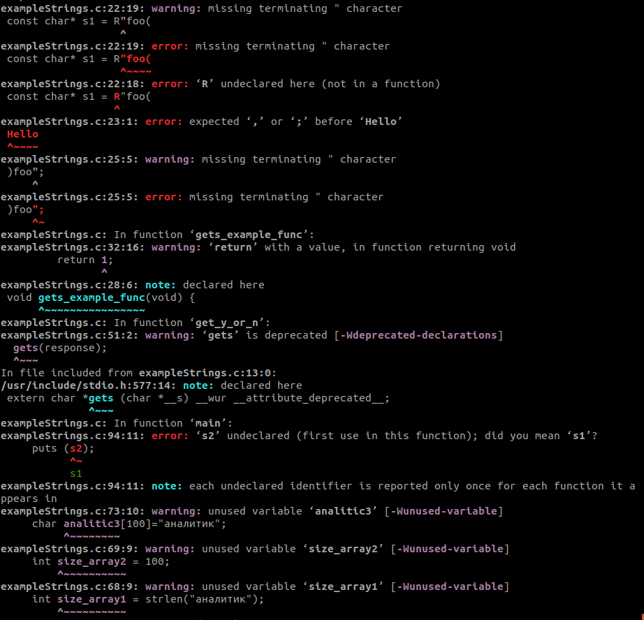
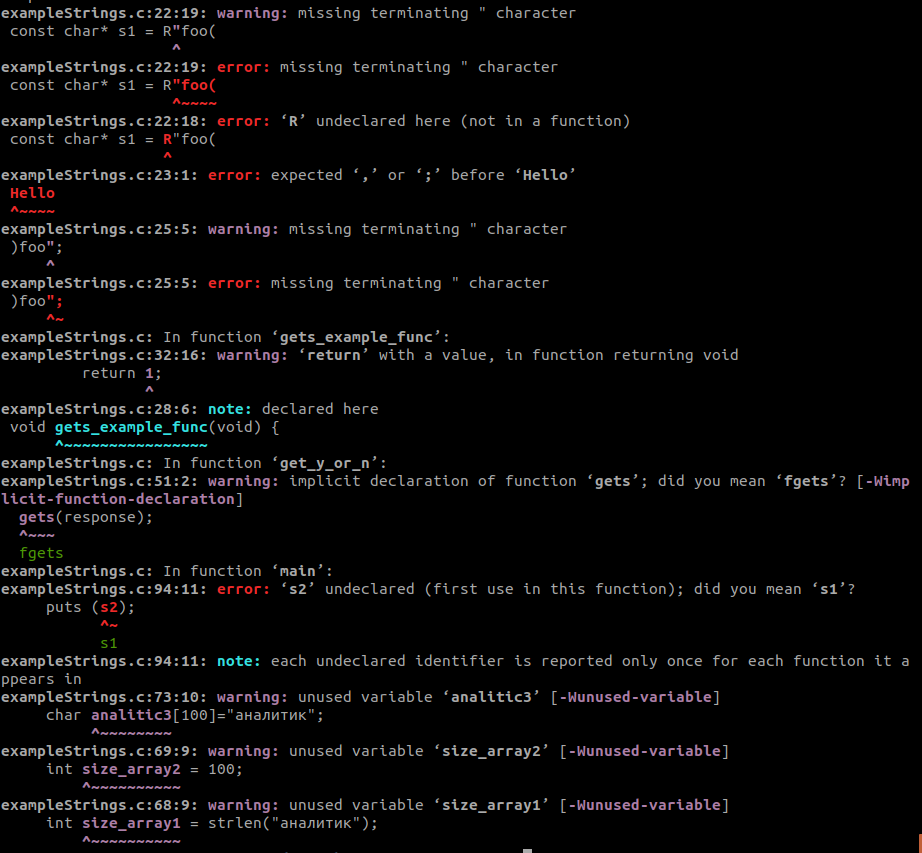
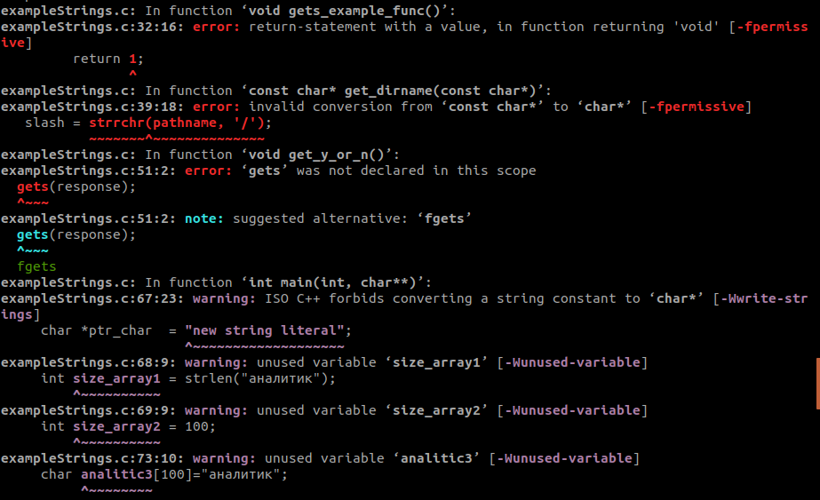
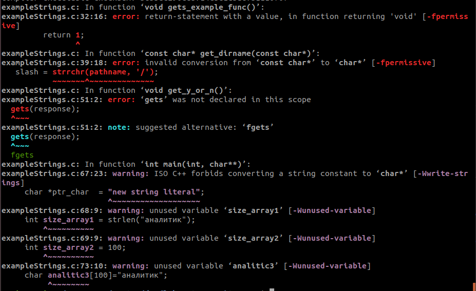
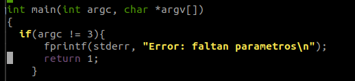

# **DPS_lab_1-Pablo_Ruiz_Encinas**

## **Consideraciones**
1) Se ha mantenido el programa original `exampleStrings.c` con todos sus fallos y problemas para poder apreciar de qué punto se parte. El programa con lo errores corregidos es el denominado `exampleStrings_def.c`
2) Se ha escogido el estándar **C11** y el compilador **gcc** para compilar el código sin errores ni warnings.
3) Las normas y recomendaciones se realizan con respecto al código del programa original `exampleStrings.c`

## **Para compilar utilizando CMake**
1) Descargar el proyecto: `git clone https://github.com/ULE-Informatica/laboratory1-Pitenager.git`
2) Ir al directorio del proyecto
3) Ejecutar: `cmake .`
4) Ejecutar: `make`

## **Compilar utilizando gcc**
1) Con respecto al estándar c99: `gcc exampleStrings_def.c -o exampleStrings -std=c99 -Wall -pedantic --verbose`
2) Con respecto al estándar c11: `gcc exampleStrings_def.c -o exampleStrings -std=c11 -Wall -pedantic --verbose`

## **Compilar utilizando g++**
1) Con respecto al estándar c99: `g++ exampleStrings_def.c -o exampleStrings -std=c99 -Wall -pedantic --verbose`
2) Con respecto al estándar c11: `g++ exampleStrings_def.c -o exampleStrings -std=c++11 -Wall -pedantic --verbose`

## **Output inicial con gcc y c99**
- Inicialmente, compilando con gcc y el estándar c99 obtenemos el siguiente output:

## **Output inicial con gcc y c11**
- Inicialmente, compilando con gcc y el estándar c11 obtenemos el siguiente output:

## **Output inicial con g++ y c99**
- Inicialmente, compilando con g++ y el estándar c99 obtenemos el siguiente output:

## **Output inicial con g++ y c11**
- Inicialmente, compilando con g++ y el estándar c11 obtenemos el siguiente output:

## **Normas y recomendaciones incumplidas**
- ARR01-C: En la línea 98
- ARR32-C: En la línea 48
- MEM32-C: En la línea 67
- MEM35-C: En la línea 66
- MSC34-C: En las líneas 51 y 75
- STR11-C / STR36-C: En las líneas 66 y 67
- STR30-C: En la línea 101
- STR32-C: En las líneas 97 y 103
- STR35-C: En las líneas 51, 78 y 80

## **Soluciones generales**
Todos los errores se sacan del fichero original: **exampleStrings.c**
- Lo primero, incluímos la libreria de tratamiento de Wide Characters añadiendo al comienzo del programa `#include <wchar.h>`
- En la línea 32, se hace un `return 1;` cuando la función es de tipo `void()`, en su lugar, se sustituye por un `exit(1);` para detener la ejecución. Se añade ademas un `fprintf(stderr, "Error en gets_example_func\n");` para reflejar el error. Aparte de esto, la función en la que se encuentra esta línea: `gets_example_func()` no se invoca a lo largo de todo el programa, con lo que se pasa a eliminar (se comenta todo el bloque).
- En la línea 48, se reserva 8 bytes de memoria para una variable que sólo se desea que ocupe 1 (más el carácter `\0`). Se cambia `char response[8];` por `char response[2];`
- En la línea 51, se hace uso de la función `gets(response);`, la cual ya está obsoleta y deprecada, se cambia por `fgets(response,sizeof(response),stdin);` para tener en cuenta, además, que el tamaño de la cadena que introduce el usuario es de la longitud que se espera
- En la línea 68, se intenta medir la longitud de una cadena en cirílico utilizando `strlen();` cuando la forma de hacerlo es utilizando `wcslen();`. De igual modo, se comenta la línea ya que la variable declarada no se utiliza en todo el programa.
- En la línea 73, se reservan 100 bytes de memoria para una variable que tan sólo ocupa 16 (son 8 caracteres, pero al ser "Wide Characters", ocupan el doble en memoria), luego se sustituye `char analitic3[100]="аналитик";` por `wchar_t analitic3[]=L"аналитик";`. De igual modo, la variable declarada no se utiliza a lo largo de todo el programa, por lo que se deja la línea comentada.
- En la línea 69, se elimina la variable `int size_array2 = 100;` debido a que pasar a no tener uso
- En la línea 75, se sustituye la función insegura `puts()` por `fputs()`, resultando en `fputs(get_dirname(__FILE__),stdout);`
- En la línea 78, si estuviésemos en un sistema operativo Windows, se sustituiría la función insegura `strcpy()` por `strncpy_s()`, de tal modo que se tendría total control sobre el buffer en el que se escribe el input y se terminaría siempre con un null-byte. Así, la línea quedaría como `strncpy_s(key, _countof(key), argv[1], 24);`. No obstante, al trabajar sobre un sistema operativo Linux (Ubuntu), la solución más segura que se ha encontrado es utilizar la función `snprintf`, de tal modo que la línea pasa a ser `snprintf(key, sizeof(key), "%s", argv[1]);`
- En la línea 79, si estuviésemos en un sistema operativo Windows, se sustituiría la función insegura `strcat()` por `strncat_s()`, así se aseguraría que el buffer termine siempre en null-byte, de lo contrario, daría error (quedando por tanto asi: ` check2 = strncat_s(key, _countof(key), " = ", 3);`). No obstante, al trabajar sobre un sistema operativo Linux (Ubuntu), la solución más segura que se ha encontrado es utilizar la función `strncat`, quedando así: `strncat(key, " = ", 24 - strlen(key) - 1);`
- En la línea 79, aplicamos lo mismo que en el punto anterior, quedando de la siguiente forma: `strncat(key, argv[2], 24 - strlen(key) - 1);`
- En las líneas 92 y 94, se sustituye la función insegura `puts(s1);` y `puts(s2);` por `fputs(s1,stdout);` y `fputs(s2,stdout);` respectivamente
- En la línea 97, se sustituye la función insegura `strncpy(array3, array5, sizeof(array3));` por `snprintf(array3, sizeof(array3), "%s",  array5);`. (Recordar que en sistemas operativos Windows, podríamos utilizar `strncpy_s()`)
- En la línea 98, se hace una doble modificación, en primer lugar se cambia el `strlen(array3)` por un `sizeof(array3)`, ya que el primero no tiene en cuenta el `\0` final. En segundo lugar, sustituye la función insegura `strncpy(array4, sizeof(array4), array3, sizeof(array3));` por `snprintf(array4, sizeof(array4), "%s",  array3);`. (Recordar que en sistemas operativos Windows, podríamos utilizar `strncpy_s()`)
- En la línea 101, se intenta modificar un String Literal al ejecutar `ptr_char [0] = 'N';`, resultando en error de ejecución ya que los String Literal están en la sección de "read-only" del segmento "data". En su lugar, se puede arreglar este error modificando la declaración de la variable de `char* ptr_char = "new string literal"` a `char prt_char[] = "new string (but non-literal)"`(aunque no haría falta realizar esta modificación si se compilase el fichero con la etiqueta `-fwritable-strings`). También se puede optar por eliminar dicha variable ya que no tiene uso alguno durante el programa.
- En la línea 83, la llamada a la función `fgets()` carece de sentido alguno, pues ya se hace la misma comprobación en la llamada a la función `get_y_or_n()`, por lo que se comenta la línea
- En la línea 63, la variable `response` pasa a no tener uso alguno durante la ejecución del programa, con lo que se elimina (se deja comentada la línea).
- En la línea 38, se declara una variable de tipo `char *` y no se inicializa, además, en la línea 39 se le asigna un valor y no se reserva memoria. Se modifican ambas líneas dejando una sola que reserva memoria e inicializa `char *slash = malloc(sizeof(strrchr(pathname, '/')));`

## **Soluciones específicas**
- Al comienzo de la funcion `main()`, se ha añadido un control del número de argumentos que se recogen para asegurar que sean los esperados. 

- En la línea 23, se ha modificado la declaración de la variable `const char* s1` para cumplir con el estándar C11 quitando la "R", ya que **gcc** no admite este formato. Si estuviésemos compilando con **g++**, sí podría mantenerse la "R" pues compila como si fuese código C++.
- En la función `get_dirname()`, se reserva memoria dinámicamente mediante `malloc` pero no se libera luego la memoria. Se añade un `free(slash);` para liberar la memoria reservada antes de salir de la función.
